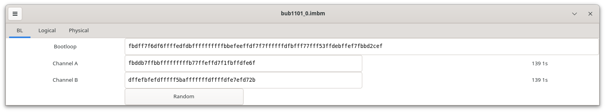
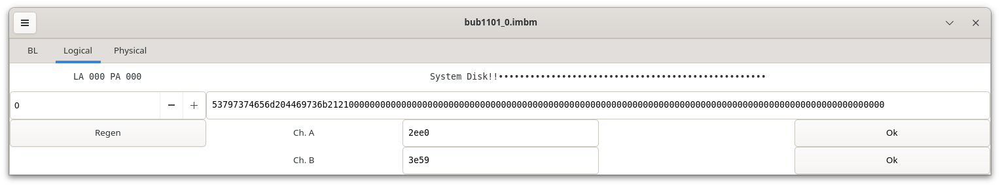
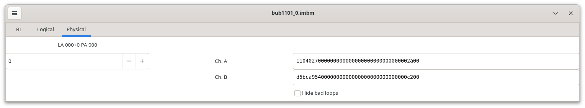

Bubbledit-gtk
=============

"Bubbledit-gtk" is a GUI tool to manipulate "imbm" files. This type of file stores the low-level image of Intel i7110 bubble memories for
emulation in MAME.

An i7110 memory is composed of two identical parts, labeled "A" and "B". Each of these parts has a bootloop and 160 data loops. Each loop holds 4096 non-volatile bits.

The raw capacity of the memory is 25% more than 1 Mbit. This level of redundancy ensured a good production yield even with a relatively high number of defective loops.

The bootloop is stored at manufacturing time and typically never changed during the life of chip. It encodes a good/bad map of data loops and it also serves for address
0 identification.

From the user point of view i7110 is addressed by a logical address ranging from 0 to 2047. At each logical address 512 user bits are stored.
A logical address is stored at 2 physical positions on data loops. In each half of the memory 135 good loops (out of 160) are needed for user data: 128 for data and 7 for Fire code.
By reading two physical locations each half of memory provides 256 user bits and 14 bits of Fire code.

Fire code an is ECC code that improves reliable storage of data. It is designed to correct a single burst of errors that is at most 5 bits long.

An imbm file stores the A and B parts of memory, each composed of boot and data loops.

## Installation

This tool is written in Rust. It is compiled by the usual `cargo build --release` command.

It relies on the Rust binding of the GTK suite of graphic libraries (GTK-rs).

## Usage

Bubbledit-gtk interface has three distinct sections:

+ "BL", to manipulate bootloop

+ "Logical", to view/edit memory content at logical addresses

+ "Physical", to view/edit memory content at physical addresses

### BL section



This section has:

+ A "Bootloop" line showing the whole 320-bit bootloop, made from alternating bits from A and B channels. 80 hex digits represent the bootloop. This field is editable.

+ A "Channel A" line showing the 160-bit (40 hex digits) portion of bootloop of channel A. This field is editable. The number of good loops (count of 1s) is shown on the right. For correct operation of memory at least 135 good loops are needed.

+ The same line for channel B.

+ A "Random" button: pressing this sets channel A & B to random values, each with 139 1s.

**Note that changing any part of the bootloop clears the entire data content of memory.**

### "Logical" section



This section has:

+ A spin-box where the logical address can be set (valid range is 0-2047). The corresponding logical/physical address is show above in read-only text.

+ The 64 bytes of data at the current logical address as 128 hex digits. This field is editable. The same content is shown above as ASCII characters in a non-editable field.

+ A "Regen" button: pressing this re-generates the Fire codes from the data content.

+ The Fire code for channels A & B. Code is 14-bit long and it's shown as 4 hex digits. These fields are editable.

+ On the right of each code a button reports its correctness. It can be "Ok" (no error detected), "Correctable" (a correctable error detected), "Uncorrectable" (an uncorrectable error detected). If pressed in the "Correctable" state, the button corrects the error and returns to "Ok" state.

### "Physical" section



This section has:

+ A spin-box where the physical address can be set (valid range is 0-4095). The corresponding logical/physical address is show above in read-only text.

+ The data at selected physical address, split in channel A & B. These fields are editable. The amount of data depends on the state of "hide bad loops" check-button: if selected, only bits in good loops are shown.

+ A "hide bad loops" check-button: it selects whether data is shown from good loops only or from all loops.

### Menu commands

Menu is accessed by pressing the three-line symbol at top-left corner of window.

#### File sub-menu

This sub-menu has these commands:

+ New (`Ctrl-N`): loads an empty memory content with a default bootloop

+ Load (`Ctrl-O`): loads memory from an imbm file

+ Save (`Ctrl-S`): saves memory into an imbm file

+ Quit (`Ctrl-Q`): Quits bubbledit-gtk

#### Image sub-menu

This sub-menu has these commands:

+ Clear (`Shift-Ctrl-N`): sets all data to 0. Bootloop is not changed.

+ Load (`Shift-Ctrl-O`): loads the data content of memory from an image file. Size of file must at least 128k-long.

+ Save (`Shift-Ctrl-S`): saves the data content of memory into an image file. Image will be exactly 128k long.

+ Fix (`Shift-Ctrl-F`): fixes all correctable errors of memory.

+ Statistics: reports the amount of good/correctable/uncorrectable physical addresses.

#### Help sub-menu

This sub-menu has just the "About" entry. It displays some info about bubbledit-gtk.

### Example usage

The Grid Compass 1101 computer had three i7110 memories, for a total of 384kb of non-volatile storage.

The following steps are needed to turn a single 384k image (`bub1101.img`) into 3 imbm files (`bub1101_0/1/2.ibmb`) , one for each i7110.

1. Split `bub1101.img` into 3 128k-long parts:

```
dd if=bub1101.img of=bub1101_0.img bs=128k count=1
dd if=bub1101.img of=bub1101_1.img bs=128k count=1 skip=1
dd if=bub1101.img of=bub1101_2.img bs=128k count=1 skip=2
```

2. For each `bub1101_*.img` file follow these steps:

    1. Create an empty memory (`Ctrl-N`)

    2. Load image file `bub1101_*.img` (`Shift-Ctrl-O`)

    3. Save corresponding imbm file `bub1101_*.imbm` (`Ctrl-S`)

When starting MAME emulation of Compass 1101, add this part to command line: `-mbm1 bub1101_0.imbm -mbm2 bub1101_1.imbm -mbm3 bub1101_2.imbm`.

## Change history

+ 1.0: first release
